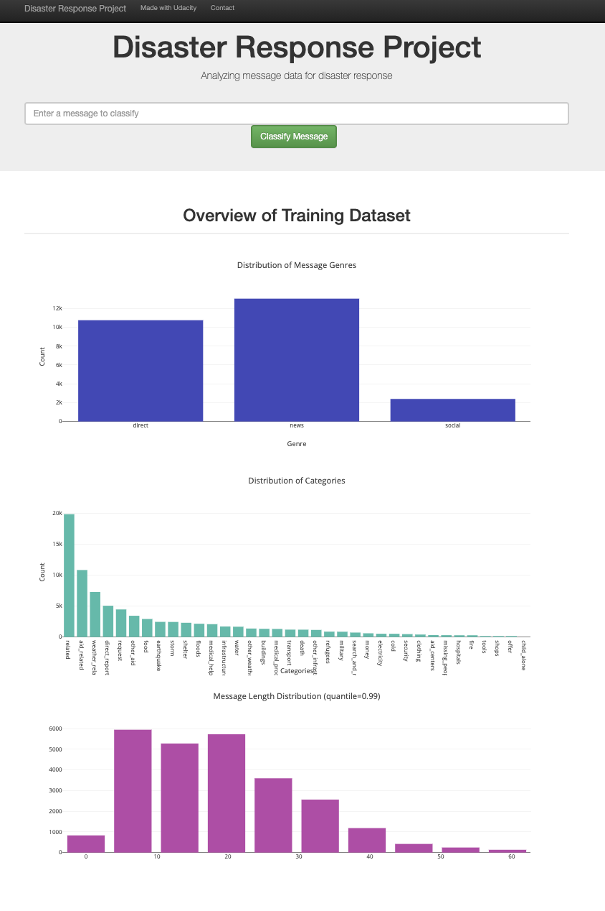
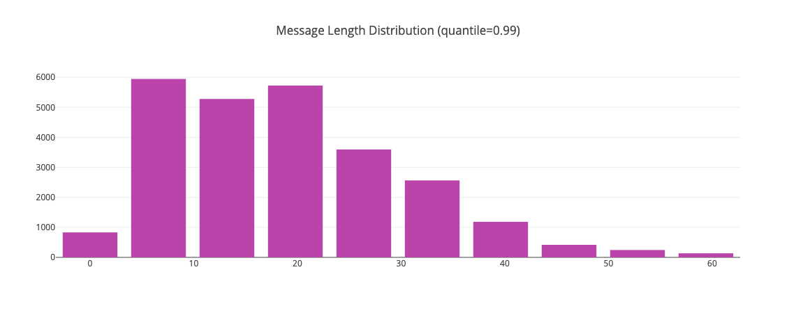
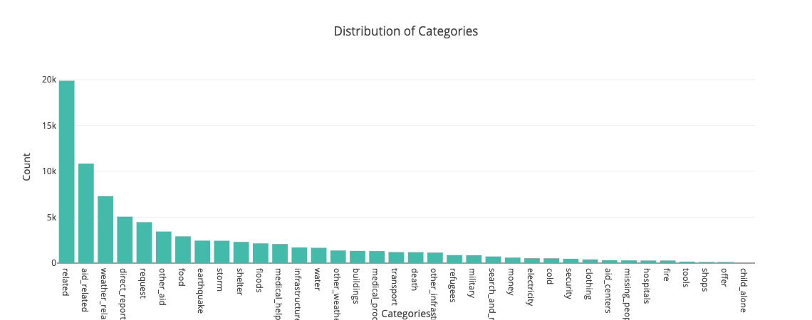

# Disaster-Response-Pipelines

## Motivation

In this project, It will provide disaster responses to analyze data from [Figure Eight](https://www.figure-eight.com/) to build a model for an API that classifies disaster messages.

This project will include a web app where an emergency worker can input a new message and get classification results in several categories. The web app will also display visualizations of the data.

Below are a few screenshots of the web app.


## Required libraries
- nltk 3.6.2
- sklearn 0.0
- joblib 1.0.1
- pandas 1.2.4
- sqlalchemy 1.4.9
- plotly 4.14.3
- flask 1.1.2


## Files

### Files:
```
- app
| - template
| |- master.html  # main page of web app
| |- go.html  # classification result page of web app
|- run.py  # Flask file that runs app

- data
|- disaster_categories.csv  # data to process
|- disaster_messages.csv  # data to process
|- process_data.py 
|- DisasterResponse.db   # database to save clean data to

- models
|- train_classifier.py
|- disaster_model.pkl  # saved model

- assets
|- message_length.png
|- distribution_of_categories.png
|- overview.png

- README.md
```

the main logic of BI work is in process_data.py and train_classifier.py
and here is a list of workflow: 
- process_data.py: Doing cleaning pipeline job:
  - Loads the messages and categories from csv
  - Combine the two datasets into pd.dataframe
  - Cleans the data
  - Stores the data in a SQLite db
- train_classifier.py: A machine learning pipeline:
  - Loads data from the SQLite database
  - Splits the dataset into training and test sets
  - Builds a text processing and machine learning ETL pipeline
  - Trains and tunes a model by using GridSearchCV
  - Outputs results on the test set for evaluating the model
  - Exports the final model as a pickle file


### How to run:
1. Run the following commands in the project's root directory to set up your database and model.

    - To run ETL pipeline that cleans data and stores in database
        `python data/process_data.py data/disaster_messages.csv data/disaster_categories.csv data/DisasterResponse.db`
    - To run ML pipeline that trains classifier and saves
        `python models/train_classifier.py data/DisasterResponse.db models/disaster_model.pkl`

2. Run the following command in the app's directory to run your web app.
    `python run.py`

3. Go to http://0.0.0.0:3001/






## Acknowledgements

I wish to thank [Figure Eight](https://www.figure-eight.com/) for dataset, and thank [Udacity](https://www.udacity.com/) for advice and review.
